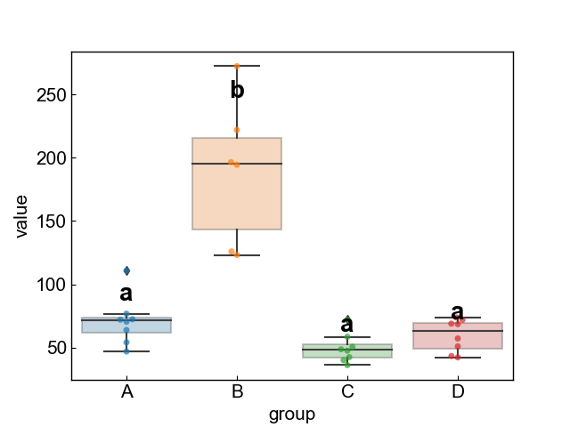
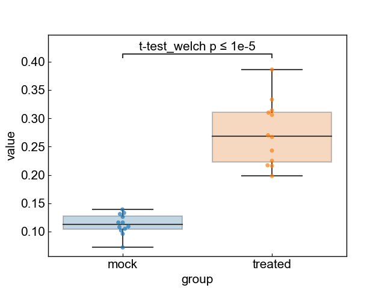

# easy-plot

The CLI tool to write plot easily

## Installation

```
pip install git+https://github.com/illumination-k/easy-plot.git
```

## Multiplot

```bash
easy-plot multisample -i ./data/multisample.csv -o ./data/multisample.png
```



## Two sample plot

```bash
easyplot twosample -i twosample.csv -o twosample.png --test t-test_welch --test-text simple
```


